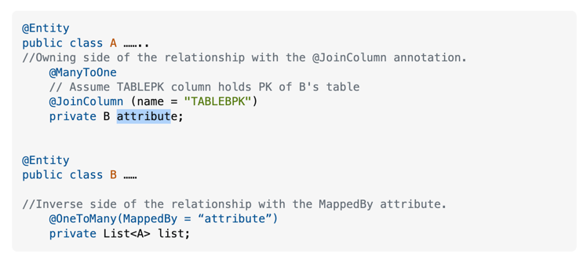

# Notes

The @mappedBy goes in the non-owning side of the relationship. The owning side is the side with the @Join Table.

### @MappedBy Annotation
For example, in a Customer-Order relationship, the owner side 
would be the Order side, and the non-owning side would be the Customer side. 

Id est, the @mappedBy goes in the entity that doesnt have  own the FK.

## @JoinColumn

Is NOT used alongside the @OneToMany annotation.  